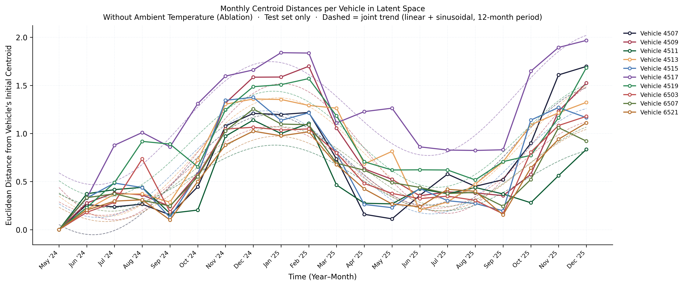
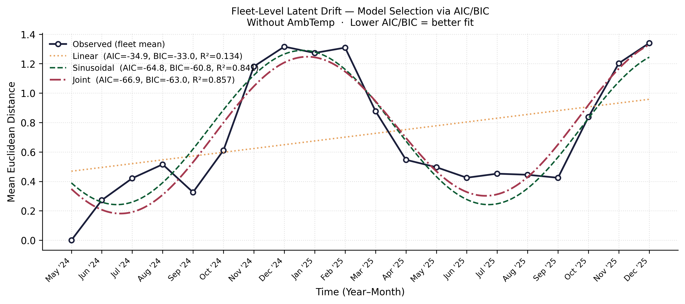
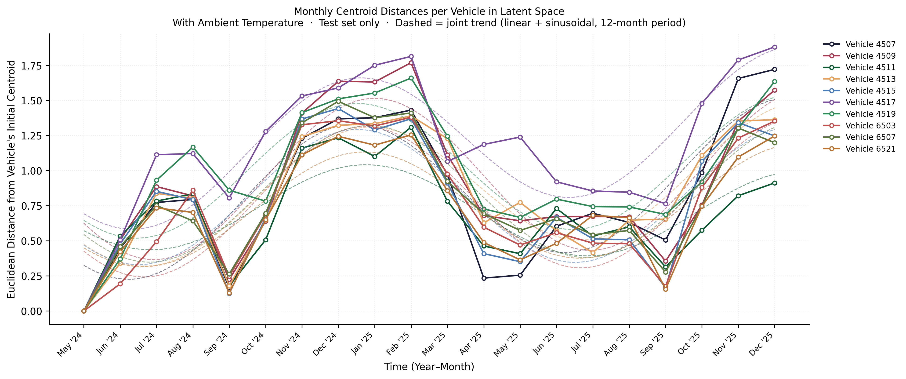

# Seasonal Effects in Anomaly Detection for Urban Transit Buses

This repository contains the evaluation pipeline, visualization scripts, and experimental results for the research paper **"Seasonal Effects in Anomaly Detection for Urban Transit Buses"**.

## Experimental Results & Visualizations

The following figures (located under `runs/run_20260521_112349/plots_en/`) outline the geometric characterization of the latent space drift and model validation.

### 1. Training Diagnostics & Reference Baselines
Monitors the optimization progress of the VAE and establishes the initial operational baseline performance.
* **Training Curves:** `plots_en/01_training_curves.png`
* **Baseline Comparison:** `plots_en/06_baseline_comparison.png`

### 2. Centroid Distances & Fleet Drift Modeling
Plots the Euclidean distance of monthly latent centroids from each vehicle's May 2024 reference configuration. It showcases the synchronized winter peaks and compares the fitness of Linear, Sinusoidal, and Joint (Linear + Sinusoidal) trajectory models.
* **Without Ambient Temperature (Baseline Variant):**
  * 
  * 
* **With Ambient Temperature (Ablation Variant):**
  * 

### Dataset

The dataset is not publicly available due to proprietary restrictions and confidentiality agreements with the operating transport company.